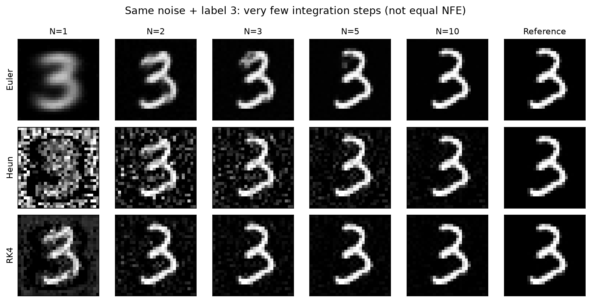
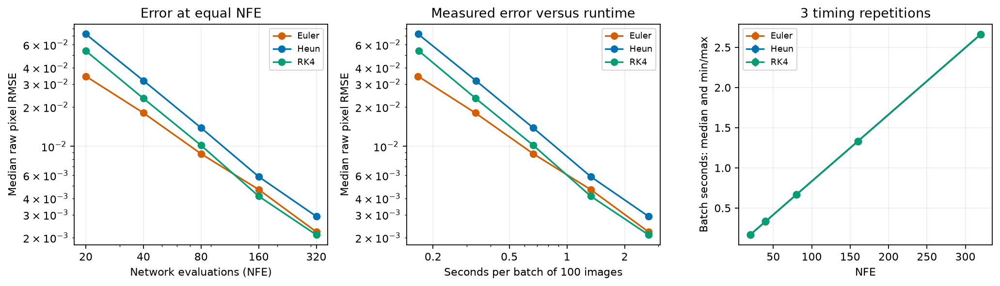

# MNIST Flow / Diffusion：从噪声生成图片与 ODE 数值分析

用一个小型条件 U-Net 理解图片怎样变成噪声、样本空间的概率路径，以及模型怎样从噪声生成数字。
固定同一个 Flow 模型，比较 Euler、Heun、RK4 的计算成本、数值误差和收敛性。

**实现全部放在 Python 文件；Jupyter Notebook 只负责参数、交互和展示。**
默认加载已有模型，不训练，也不自动重跑完整数值实验。

## 1. 配置环境

下载仓库并解压，或用 Git 克隆：

```bash
git clone https://github.com/hxia-ai4bio/bs6221-mnist-flow-diffusion.git
cd bs6221-mnist-flow-diffusion
```

进入仓库根目录后执行：

```bash
conda env create -f environment.yml
conda activate bs6221-flow
python -m ipykernel install --user --name bs6221-flow-shared --display-name "BS6221 Flow (shared)"
```

没有 Conda：使用 Python 3.10–3.12 创建虚拟环境，激活后运行：

```bash
python -m venv .venv
# Activate .venv using the platform instructions below, then install dependencies.
python -m pip install -r requirements.txt
python -m ipykernel install --user --name bs6221-flow-shared --display-name "BS6221 Flow (shared)"
```

Mac/Linux 激活：`source .venv/bin/activate`；Windows PowerShell：`.venv\Scripts\Activate.ps1`。
NVIDIA 用户先按 [PyTorch 安装选择器](https://pytorch.org/get-started/locally/) 安装适配驱动的
`torch` / `torchvision`，再安装其他依赖。新训练和交互采样支持 auto / CPU / MPS / CUDA；
原完整分析脚本目前自动选择 MPS 或 CPU。

首次安装依赖需要联网。Mac CPU 已验证；Windows/Linux/CUDA 未实机验证。
`environment-flow.yml` 与 `requirements.lock.txt` 保留原 macOS 环境版本记录，
不作为其他平台的安装入口。跨平台不保证结果逐位相同或耗时相同。

### 数据与模型

MNIST 官方压缩数据和 seed-42 划分随仓库提供，位于 `Flow_Group_Package/data/`。
新训练/演示直接读取这些文件；原完整分析使用根目录 `data/`，可离线还原：

```bash
python scripts/restore_shared_data.py
```

推理权重已公开发布到 [Hugging Face](https://huggingface.co/hx03-info/bs6221-mnist-flow-diffusion)，包括 Flow EMA、DDPM EMA 和评价分类器。
已验证无需登录可下载，且所有冻结文件的 SHA-256 与本地清单一致。
`models/hub.json` 记录仓库和不可变提交版本 `1edc45c59e32eac9c55ddad3485eb4949a20a5d4`，组员执行：

```bash
python scripts/download_weights.py
```

下载脚本核对 SHA-256，不覆盖已有但不匹配的权重。

## 2. 可选：训练自己的模型

已有权重足够运行全部演示。若只想看生成和 ODE 比较，可跳过本节。

先用小规模训练验证数据、梯度、保存和加载流程：

```bash
python scripts/train.py --model flow --steps 1000 --batch-size 64 --lr 0.0003
```

也可以按完整 epoch 训练，或训练 DDPM：

```bash
python scripts/train.py --model flow --epochs 1 --batch-size 64 --lr 0.0003
python scripts/train.py --model diffusion --epochs 1 --batch-size 64 --lr 0.0003
```

`--steps` 和 `--epochs` 二选一；默认 1,000 步。一个 epoch 随机打乱后遍历 55,000 张训练图片，
最后一批可能小于 batch size。epoch 的步数为 `ceil(55000 / batch_size)`。
可设置 `--device cpu`、`--seed`、`--ema-decay`、`--validation-every`、`--validation-samples`。
验证集为固定划分中的 5,000 张图片，训练/权重选择不读取官方测试集。

每次创建独立的 `outputs/training/<模型>_<运行编号>/`，不会覆盖预训练模型：

| 文件 | 内容 |
|---|---|
| `config.json` | 学习率、batch size、种子、EMA、预算和数据划分哈希 |
| `history.csv` | step、epoch、训练 MSE、验证 MSE、梯度范数和耗时 |
| `best.pt` | 按验证 MSE 选择的 EMA 推理权重 |
| `latest.pt` | 最终模型、EMA、优化器与随机状态；当前 CLI 尚未提供恢复训练选项 |
| `summary.json` | 完成预算、最佳验证 MSE 和运行摘要 |

Flow 的 error 是速度预测 MSE；DDPM 的 error 是噪声预测 MSE，不能直接比较大小，
也不能把它们当成图像生成质量或 ODE 积分误差。短训练通常不能达到附带模型的质量。
新训练使用打乱的完整遍历；原历史训练使用有放回抽样，图里的 epoch 标为等效遍历次数。

## 3. 展示：按顺序打开一个 Notebook

```bash
python -m jupyter lab notebooks/00_project_demo.ipynb
```

选择 `BS6221 Flow (shared)` 内核，从头运行。Notebook 内没有模型/求解器/训练实现。

### 训练参数与曲线

先展示已有训练记录：step、等效 epoch、训练/验证 MSE，以及学习率和 EMA 参数。
早期与续训的验证协议不同，分开画线；续训未记录的训练损失不补造。
默认 `RUN_TRAINING=False`；需要训练时设为 `True` 并调整 `TRAIN_CONFIG`。
训练 Flow 后会加载新 `best.pt`；也可以在入口将 `FLOW_WEIGHTS` 指向自己的权重路径。

### 1）图片到噪声、概率路径、模型怎样生成图片

- **图片 → 噪声**：真实训练图片的 Flow 固定噪声插值，以及 DDPM 每步加入新噪声的正向链。
- **样本空间概率路径**：把训练图片看作 784 维向量，在固定训练 PCA 轴上画噪声 → 图片的经验路径。
- **模型生成**：用新的初始噪声，展示已训练 Flow 的实际积分轨迹和 DDPM 的反向采样过程。

图片到噪声的进度记为 s；Flow 从噪声生成图片使用 t=1−s。
PCA 图只是 2D 投影，不是完整概率密度；构造的插值路径与模型实际生成路径分开展示。

### 2）选择数字和噪声，展示生成过程

交互面板可选择数字 0–9、噪声种子、图片数、噪声尺度、求解器和步数。
先点击“预览所选噪声”，再点击“生成并展示轨迹”。固定模型、标签和噪声可重复生成。
“相同噪声比较求解器”固定初值并使用同一 NFE 预算；不同初始噪声产生不同写法。

也可以在 Notebook 或自己的 Python 脚本中调用：

```python
from bs6221_flow.sampling import load_flow, generate_images

model = load_flow(device_preference="auto")
result = generate_images(digit=3, n=4, seed=42, method="Heun", steps=40,
                         trajectory=True, net=model)
```

结果包含原始生成张量、初始噪声、标签、轨迹、真实时间点及参数。
自定义噪声使用 `noise=...`，形状 `[n,1,28,28]`；同一张量可以用于不同数字/求解器。
显示时限制灰度范围，Flow 积分状态不裁剪。

### 3）ODE 数值分析：参数、成本、收敛性

先展示原冻结模型的完整实验记录，再提供“点击才计算”的小规模面板：

- 调整样本数、步数列表、NFE 预算、参考分辨率和计时重复。
- Euler 每步调用网络 1 次，Heun 2 次，RK4 4 次：NFE = 步数 × 阶段数。
- 相同步数和相同 NFE 分开比较，固定模型、标签和初始噪声。
- 展示步长–RMSE、NFE–RMSE、NFE–耗时曲线与结果表。
- 使用 CPU float64 RK4 两级加密参考；参考诊断未通过时不拟合观测阶。

参考解是同一网络 ODE 的近似数值解，不是真实图片或严格真值。
两级加密差异是分辨率诊断，不是严格误差界。观测阶还需确认渐近区间。
计时不包含模型加载、画图与参考解计算；报告当前设备、批量、重复次数与权重哈希。
小样本面板用于探索；原正式数值实验使用 100 个独立噪声（每类 10 个）。

## 4. 完整实验与结果记录

`results/` 保存精选原实验结果和来源信息，默认直接展示；重构验证不等于重新训练或重跑正式实验。

原冻结模型、相同初始噪声下的求解器生成示例：



误差与计算成本的原实验记录：



- `results/training/`：原训练/续训记录和协议说明。
- `results/numerical_analysis/`：误差、观测阶、等 NFE、参考诊断、图片及原运行配置。
- `outputs/`：新生成、训练和计算缓存，不上传 GitHub。

原完整 Flow 分析实现保留在 `scripts/flow_numerics.py`，生成质量评价在 `scripts/mnist_quality.py`。
完整质量实验需要生成 90,000 张图片，成本明显高于演示；先验证小规模流程。
完整 ODE 重算命令和参数见 [实验协议](docs/experiment_protocol.md)。
历史续训脚本 `finetune_conditional.py` 需要本地完整训练 checkpoint（本仓库只下载 EMA 推理权重）；
新训练请使用 `scripts/train.py`。`Flow_Group_Package/validation_report.json` 是旧独立包的历史验证记录，
本次仓库的独立副本验证见 `reproduction_check.json`。

## 5. 目录

```text
bs6221_flow/             # 数据、模型、训练、采样、展示和交互实现
notebooks/              # 总展示入口与三个分章节 Notebook
scripts/                # 数据恢复、训练、下载、批量实验入口
models/hub.json         # Hugging Face 仓库与固定版本
checkpoints/frozen/      # 权重下载位置、冻结结构与校验清单
Flow_Group_Package/data/# 随仓库提供的压缩 MNIST 和固定划分
results/                # 精选实验记录；有来源，非自动更新的缓存
docs/                   # 实验协议、模型说明
```

请下载整个仓库；新版 `Flow_Group_Package/Flow_Group.ipynb` 也调用共享 Python 模块，
不能只复制其文件夹。原 ZIP 保留为旧独立版本，本次 GitHub 发布不使用旧 ZIP。

## 参考

- [Flow Matching for Generative Modeling](https://arxiv.org/abs/2210.02747)
- [Denoising Diffusion Probabilistic Models](https://arxiv.org/abs/2006.11239)
- [MNIST](https://yann.lecun.org/exdb/mnist/)
